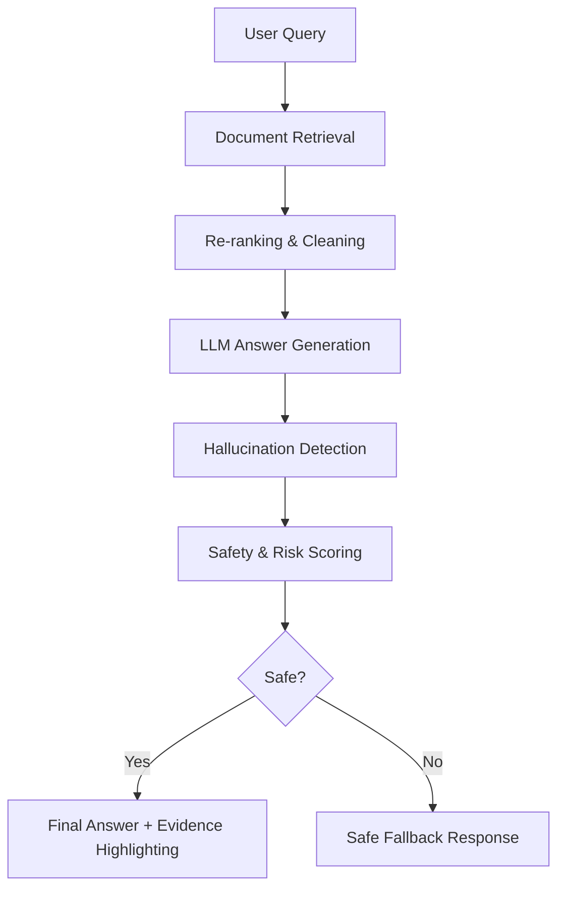

# Trustworthy Pregnancy and postpartum‑Guidance ‑Guidance RAG System

A fully local, explainable, safety‑validated Retrieval‑Augmented Generation (RAG) system designed to provide **reliable pregnancy and postpartum‑related information** with **transparent reasoning**, **hallucination detection**, and **safety scoring**.

This project is built to demonstrate **trustworthy NLP**, suitable for AI safety, explainability, and responsible NLP.

---

## 🔍 Project Flow Diagram

```text
                   ┌────────────────────────┐
                   │     User Query Input   │
                   └─────────────┬──────────┘
                                 │
                                 ▼
                     ┌──────────────────┐
                     │ Query Rewriting  │
                     │ (Local LLM)      │
                     └─────────┬────────┘
                               │
                               ▼
                   ┌────────────────────────┐
                   │  Document Retrieval    │
                   │ (Sentence Transformers)│
                   └─────────────┬──────────┘
                                 │
                                 ▼
                ┌────────────────────────────────┐
                │  Context Construction + RAG    │
                │ (Mistral/LLama‑Small Model)    │
                └─────────────────┬──────────────┘
                                  │
                                  ▼
                    ┌──────────────────────────┐
                    │ Hallucination Checker    │
                    │  (Context‑Faithfulness)  │
                    └──────────────┬───────────┘
                                   │
                                   ▼
                       ┌─────────────────────┐
                       │ Safety Evaluation   │
                       │ Toxicity/Misinform  │
                       └──────────┬──────────┘
                                  │
                                  ▼
                        ┌──────────────────┐
                        │ Final Response   │
                        │ + Explanations   │
                        └──────────────────┘
```

---

## 🧱 Repository Structure

```text
trustworthy-rag/
│
├── README.md
├── requirements.txt
├── pyproject.toml
├── data/
│   ├── raw/
│   ├── processed/
│   └── sample_corpus.txt
│
├── src/
│   ├── retriever/
│   │   ├── embedder.py
│   │   ├── retriever.py
│   │   └── indexing.py
│   │
│   ├── generator/
│   │   └── rag_model.py
│   │
│   ├── safety/
│   │   ├── hallucination_check.py
│   │   ├── safety_classifier.py
│   │   └── rule_based_filters.py
│   │
│   ├── explainability/
│   │   ├── lime_explainer.py
│   │   └── shap_explainer.py
│   │
│   ├── evaluation/
│   │   ├── faithfulness_eval.py
│   │   └── safety_eval.py
│   │
│   └── ui/
│       └── streamlit_app.py
│
├── models/
│   ├── local_llm/
│   └── sentence_transformer/
│
└── scripts/
    ├── prepare_corpus.py
    ├── build_index.py
    └── run_inference.py
```

---

## ⚙️ Installation

Clone the repository:

```bash
git clone https://github.com/yourusername/trustworthy-rag.git
cd trustworthy-rag
```

Create environment:

```bash
python3 -m venv venv
source venv/bin/activate
```

Install dependencies:

```bash
pip install -r requirements.txt
```

Download embedding model:

```bash
python scripts/build_index.py
```

Run the RAG system:

```bash
python scripts/run_inference.py
```

Run Streamlit UI:

```bash
streamlit run src/ui/streamlit_app.py
```

---

## 🧠 Local Models Used

```text
Embedding Model: sentence-transformers/all-MiniLM-L6-v2
Local LLM: TheBloke/Mistral-7B-Instruct-GGUF (quantized)
Safety Classifier: unitary/toxic-bert
```

---

## 🧪 Features

**Retrieval-Augmented Generation** using local embeddings.

**Hallucination Detection:**

* Overlap scoring
* Context contradiction classifier
* Source grounding signals

**Safety Evaluation:**

* Toxicity classifier
* Pregnancy‑risk keyword detector
* Multi-stage rule filters

**Explainability:**

* LIME token contribution
* SHAP attention visualization
* Retriever transparency logs

---

## 🧼 Hallucination Checking

Hallucination is detected using:

```text
1. Context Overlap Ratio
2. NLI-based contradiction classification
3. Retrieval distance thresholds
```

Low overlap → flag response.
High contradiction probability → block.

---

## 🔐 Safety Evaluation

The safety evaluator runs:

```text
• Toxicity detection
• Harmful medical advice flags
• Rule-based risk patterns
```

If unsafe → user gets a safe alternative.

---

## 🗃️ GitHub‑Ready Code Components

```text
src/retriever/* → embeddings + retrieval
src/generator/* → RAG model code
src/safety/* → hallucination + toxicity modules
src/explainability/* → LIME + SHAP
src/evaluation/* → faithfulness + safety metrics
src/ui/* → Streamlit interface
scripts/* → end-to-end runnable scripts
```

---

## 📊 Evaluation Metrics

Faithfulness:

```text
• Context precision
• Answer grounding score
• NLI contradiction rate
```

Safety:

```text
• Toxicity
• Risk phrase count
• Unsafe answer interception rate
```

---

## 📚 Citation

```text
@misc{trustworthy_rag_2025,
    title={Trustworthy Pregnancy-Guidance RAG System},
    author={Your Name},
    year={2025}
}
```

---

## 📝 License

MIT License.

## Research Contributions: Trustworthiness & Explainability

### Trustworthiness

This project enforces trustworthiness by design, not as an afterthought. Key mechanisms include:

* **Hallucination Detection Module** that performs sentence-level factual consistency checks using retrieval alignment, NLI verification, and semantic similarity scoring.
* **Safety Scoring System** that provides a numerical risk assessment for every answer, combining uncertainty, evidence coverage, and domain-critical content detection.
* **Fallback Mechanisms** to prevent unsafe or unsupported medical statements by triggering refusal or redirection when risk levels are high.
* **Evidence-Grounded RAG Architecture** ensuring that every generated answer is rooted in authoritative maternal and postpartum health documents.

### Explainability

Explainability is built into how the system communicates its reasoning:

* **Evidence Traceability** connects each generated sentence to the exact retrieved document lines.
* **Cited, Per-Sentence Grounding** so users can inspect provenance clearly.
* **Transparent Processing Pipeline** with step-by-step visibility: retrieval → re-ranking → generation → hallucination check → safety score.
* **Rationale Outputs** that explain why an answer was classified as safe/unsafe, why fallback triggered, and which evidence influenced the model.

## Trustworthy & Explainable System Flow



